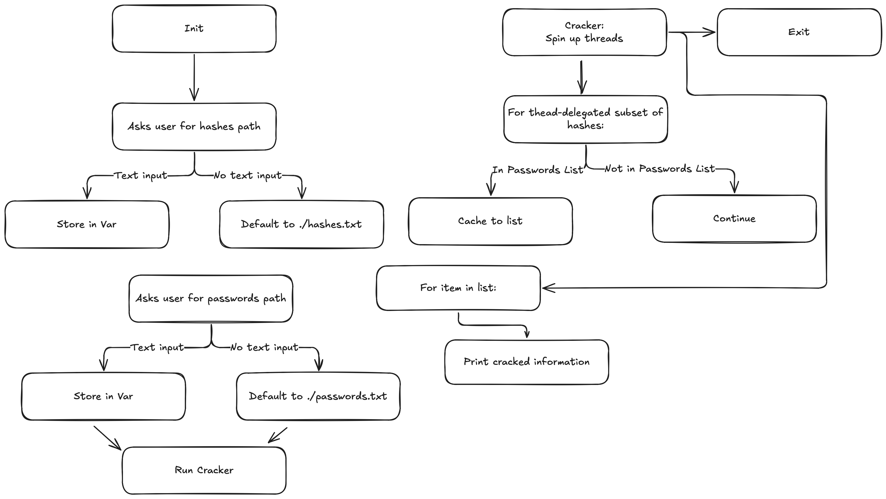

# Jane the Ripper

Jane the Ripper is a simple multithreaded password cracking tool written in Python.


### Usage:

Don't. Use JohnTheRipper instead.

```
python3 jane.py
```

Input the path to your hashes list, your passwords list, and select your algorithm. (Jane currently supports MD5, SHA1, and SHA256)

### Design Flow:



### Testing:

Testing has been conducted with Pytest to validate cracking effectiveness, and the ability to widthstand unexpected inputs.

You may validate these claims with ``pytest``.


```
pytest
```